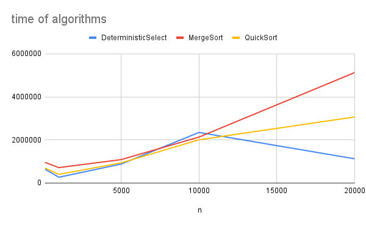
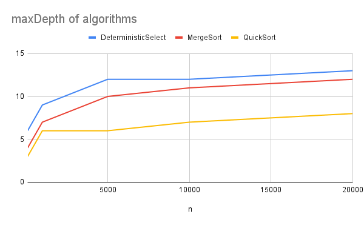
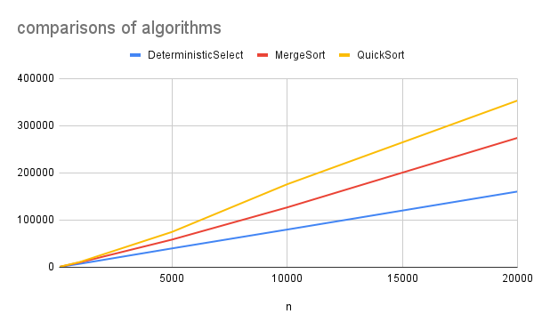
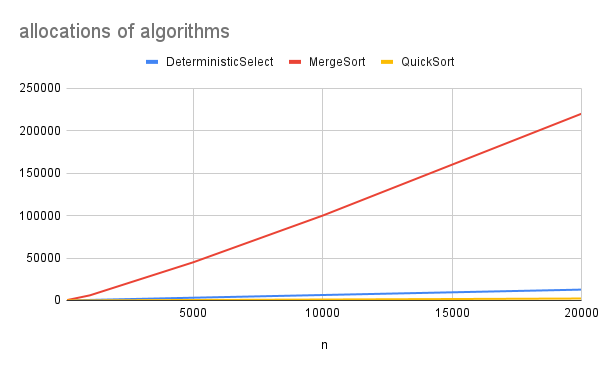

# Report
## 1.Architecture notes
To control depth, allocations and comparisons, I created class 'Metrics'.  
**comparisons** incremented every key comparisons in sorting, selecting and distance check.  
**alocations** incremented when creating a new array, or when reusing arrays, e.g subarrays, buffers.  
**maxDepth** updated at each recursive call to record the maximum recursion depth.  
  
Additionally, to keep code clean, in **Metrics** i have method to reset all the metrics and to print them. I used **Metrics.reset()** at beginning of each algorithm 
to delete values left from previous algorithms, and **Metrics.printMetrics()** at the end.  

### About recursion track.
**QuickSort** recurses oly on the smaller partition and iterates over the larger one.
In my code, the line **if (leftPartSize < rightPartSize)** is responsible for deciding recursion.

**MergeSort** always splits array evely at **middleIndex = (left+right)/2**, so recursion tree is balanced and the recursion maxDepth is O(logn)

**DeterministicSelect**, after choosing pivot, i split the array into left(smaller or equal to pivot) and right(larger than pivot).
Then i compare if the rank is in the left or right, and go on that side.   
This means i only recurse on the part that contains rank element, and also the smaller side is preferred here because
if the element is on the left (which is usually smaller than the right), recursion happens there

**Closest Pair** splits array into left and right by x-coordinate and recurses both sides, but also checks a strip around teh divinding line to check pairs that cross those halves. 
This ensures correctness without increasing recursion depth.

### ABout allocation track.
**MergeSort** uses reusable buffer for merging, and it helps to avoid repeated allocations for creating new subarrays.  

**QuickSort** also doesn't create new subarrays for left/right parts of the array. It uses leftIndex/rightIndex as bounds of subarray it sorts, it happens in original array.  

**DeterministicSelect** doesn't create new subarrays. It sorts small groups of 5 elements and swap medians to the front of the array. So it also works inside original array, 
just moving medians around.

### About CUTOFF optimization.
**MergeSort** and **QuickSort** uses **Utils.insertionSort()** to solve small subproblems, to sort arrays of size <= 16. It improves cache efficience, because
insertionSort avoids extra recursive call for small arrays, reducing stack usage, while Quick/Merge Sorts use recursion.

---

## 2. Recurrence analysis for each algorithm

### MergeSort
It splits the array evenly at **middle=(left+right)/2**, then recursively sorts both halves, and merges them linearly.   
So the recurrence is: **T(n) = 2T(n/2) + n**  
where 2T(n/2) - two recursive calls on halves,  n - linear time to merge two halves.  
The recurrence is exactly the form of **Master Theorem** T(n)=aT(n/b)+f(n)  
a=2, b=2, f(n)=n. log_2(2)=1, k=1, p=0. Here **log_b(a)=k**, so it **Case 2** and the answer is Θ(n^1log^(0+1)n) or simply **Θ(nlogn)**

### QuickSort
Picks a pivot and rearranges the array so that elements<=pivot go to the left, other to the right.
This happens once and takes linear time (n).   
After partitioning, assume left part has k elements, right has n-k-1 elements (subtract pivot itself). QuickSort recursively sorts both parts
so the recursive part is **T(k)+T(n-k+1)** plus (n) linear time, k depends on pivot choice. But with random pivot, k is roughly n/2, so recurrence becomes  
**T(n) = 2T(n/2) + n**, same as MergeSort -> it's Case 2 of Master Theorem ->  **Θ(nlogn)**

### Deterministic Select
Splits the array of size n into **n/5** groups of 5 elements each. It also finds the median of each group, which takes linear time over all groups **(n)**.
To get a pivot, it finds the median of those n/5 medians, and this is **one recursive call of size T(n/5)**.  
Each median of 5 guarantees that at least 3 elements in that group >=or<= the pivot. So at least 30% of the elements 
are smaller, 30% are larger than the pivot.  
After partitioning the bigger side has at most 7n/10. It gives recursive call of size **T(7n/10)**. And it takes **n** time
on partitioning itself. So the recurrence is **T(n) = T(n/5) + T(7n/10) + n**  
And since fraction is <1 the recursion shrinks fast, and total time becomes **0(n)**

### Closest Pair.
There are recursive calls for two halves, when splitting points into pxLeft and pxRight, and then 
splitting py into pyLeft and pyRight, so it takes **2T(n/2)**.  
After recursion, it collects points near the dividing line into a strip array, and checks distances
only for next 7-8 neighbours. It takes linear time **(n)**, because every point goes to the strip check
at most once.  
So recurrence is **T(n) = 2T(n/2) + n**, same as for merge and quick sort.  
it's Case 2 of Master Theorem ->  **Θ(nlogn)**

---
## 3. Plots

### Time vs n
**MergeSort**'s running time growth close to **nlogn**. At n=20000 the time was ~5.1ms which is consistent with the expected 
asymptotic growth.  
**QuickSort** also follows **nlogn**, but with a bit smaller constant factors. In practice usually quick sort is faster
than merge sort because it avoids extra buffer allocations.  
**Deterministic Select** theoretical growth is linear **(n)**. But due to big constant factors like grouping into fives,
recursive median of medians, times were not always the smallest in practice.  
**ClosestPair** matches **nlogn** complexety. The strip check adds only small constatnt factor,
7-8 comparisons for one point

### Depth vs n
**MergeSort** increases depth by 1 each recursive call. Since the array is split evenly each time, **depth=log_2(n)**.
In metrics, at n=20000 maxDepth=12 and log_2(20000)=14.3, so it very close to maxDepth=12.  
**QuickSort** depth depends on pivot balance, with randomized pivot expected ~log_2(n). In worst case, depth=n.
At n=20000 maxDepth=8, which is smaller than log_2(20000)=14.  
**Determinict Select** only one recursive call continues. At n=20000 maxDepth=13, which matches slow growth compared to n.  
**ClosestPair** depth=log_2(n) because it recursively splits points in half. 

### Comparisons vs n
**MergeSort** comparisons growth **nlog_2(n)**. At n=20000 comparisons=274K, close to expected
20000*log_2(20000)=286K.  
**QuickSort** at n=20000 comparisons=353K, larger than merge sort which matches theory.  
**Deterministic Select** comparisons grow linearly **cn**. At n=20000 comparisons=160K.  
**Closest Pair** expected nlogn because of recursive split and linear strip checking.
In practice, constants are smaller because the strip only needs <=7-8check for one point.

### Allocations vs n
**Merge sort** allocations scale almost like linearly with n. At n=20000 allocations=220000, so there is high memory overhead, because it repeatedly allocates subarrays when merging.  
**QuickSort** allocations grow very slowly. At n=20000 allocations=2270. It's mostly in-place, gives best memory efficiency.  
**Deterministic Select** allocations increase with n, but less than Merge Sort. At n=20000 allocations=12764. Overhead comes from grouping into fives and
recursive calls, but no big arrays.
**Closest Pair** grow faster than quick sort, but lower than merge. 

### constant-factor effects
**Cache**  quick sort is faster in practice because it works in-place and uses cache better, unlike merge sort
with its extra buffer.
**GC(garbage collector)** merge sort and closest pair create many arrays which may trigger garbage collection more often and slow down the program

---
## 4.Summary
**Merge and Quick Sorts** follow the expected **nlogn**. Quick sort is even faser in practice due to fewer allocations.  
In **Determenistic Select** theory says linear, but metrics are higher because of big constant factors, like grouping, recursion.  
**Closest Pair** also matches **nlogn** growth  
About **depth and allocations**, overall everything within theoretical bounds. Quick sort is best in memory, merge sort is the worst.
